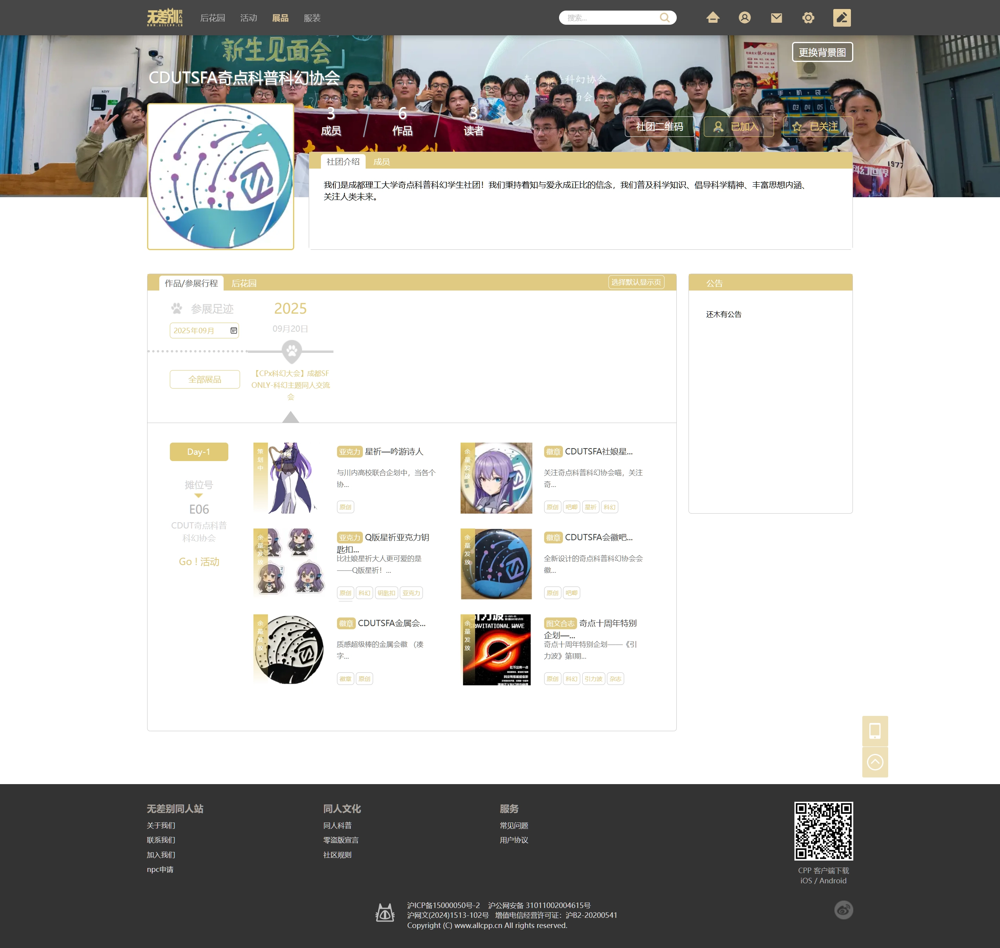
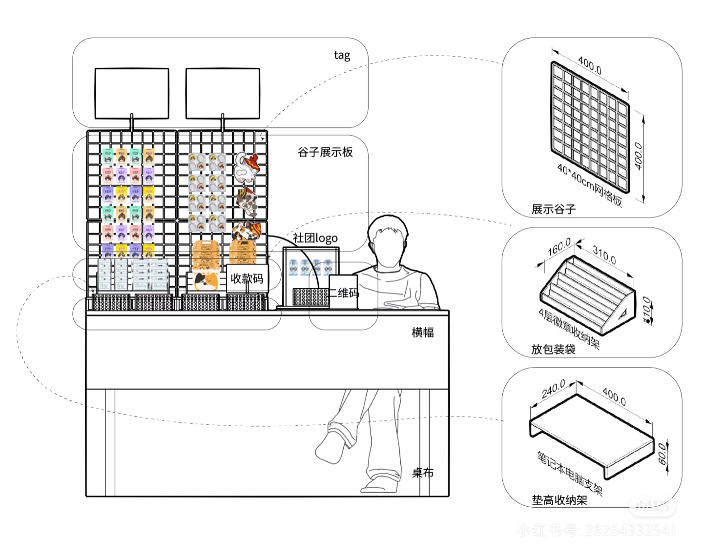
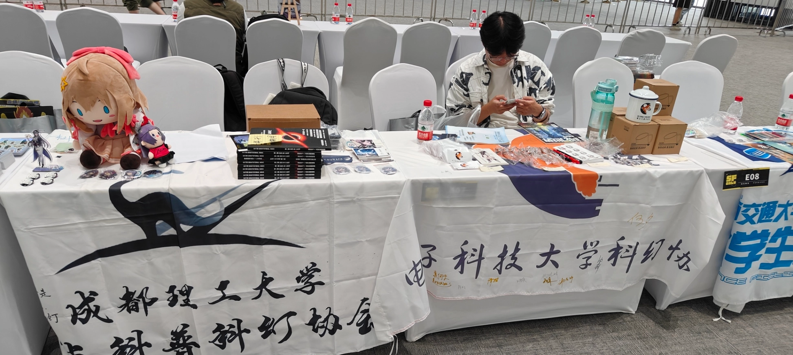

你好！首先介绍下，我是Jerriel，是奇点幻协[^1]25年的会长。我的邮箱是jerriel@qidian.com。本文写于2025年国庆期间[^2]。

在此之前的一个月，奇点先后参加了银河科幻大会，并以高校社团身份在【**CP×科幻世界 SF ONLY 同人交流会展**】参展；随后又参与了校内的百团大战。

这两场活动有一个共同点——我们都有自己的展摊点位。因此，本篇文章将围绕这个小小的摊位展开：从申摊、摆摊，到看摊、守摊、收摊，你会在这里看到许多实用经验，也许还能发现一些之前未曾留意的问题。

# 为什么要出摊

如果你去过各类大型漫展、同人展会等活动，你一定见过了各种形形色色的展摊。在这类活动上，无论是大型的企业，公司，还是俱乐部，同好会甚至是个人，都希望能有一片地方展示 IP 文化、产品、设计理念等。比起线上低转换率的流量，线下活动带来的流量与关注是可观的，无论是产品的售卖还是文化理念的宣传，线下活动都是各位不可多得的宣传窗口。

目前，全国各地的高校幻协大多仍以校内活动为主阵地，这无可厚非，且短期内难以改变。高校社团的关注度、人流量与支持资源，主要来自校内外的科幻群体。虽然很难，我还是希望各位负责人把活动范围放在高校范围外，为社团争取更多社会关注，也为科幻争取更多声音。这种关注，对社团来说总是好事。如果你们有自己的作品或制品，它可以转化为流量甚至收益。即使没有，也总会有社会上的同好被你们所吸引，多少也能带来些情绪价值。

从更广的角度看，科幻事业的发展离不开商业的支持，也离不开各高校社团、科幻爱好者、社会人士集体等科幻群体的参与。与前者相比，后者更贴近群众。我希望未来社会在谈及科幻时，关注的不仅是各类 IP、作品和商品，更能看见背后那些真正热爱科幻、推动它前进的普通人。因此，高校幻协参与这类活动十分必要。有没有展品并不重要，重要的是——**让大家听见你们的声音。**

# 找一个好活动

以成都高校为例，这类活动的机会其实不少。据我目前了解，高校科幻协会通常可以参加的展会主要有——**CD 展（Comiday）**、**世界线**、以及**科幻大会**。这些活动都有较为稳定的举办周期和可观的人流量。如果要细分：世界线的人流量最大，CD 展的摊位最多、最容易申请，而科幻大会虽然不一定每年都有展摊机会，但绝对是最契合科幻主题的展会。

先说**世界线**。它的定位是【**漫展**】。一般来说，漫展对外开放的个人摊位较少，且常常需要绑定特定IP。如果你们的展品包含了一些热门的科幻IP或者元素，还是可以去试试的。

再来说 **CD 展**。它的定位是【**同人展**[^3]】。同人展通常会对外提供**海量**的摊位——不论是个人的还是厂商的，甚至往往还有专门的高校社团街道。同人展的好处就是几乎没有任何tag或者元素的限定：无论是热门 IP 的二创、冷门题材，还是原创设定、原创作品，在这里都不会有任何的违和。

值得一提的是，许多科幻领域的官方机构也会在 CD 展中亮相，比如《科幻世界》杂志社、赛凡、读客等。你可以在近两次的会场中看到他们的身影。

至于这次我们参加的 **2025 年银河科幻大会**，可以说是非常幸运——恰好赶上了 CP 这个同人展“老大哥”与《科幻世界》的合作。至于以后有没有这类非常契合的活动我无法保证，但是请相信，总会有机会的！

> [!TIP] 题外话
> 
> 在这次大会上，我们第一天就卖出了 20 本会刊《引力波》（定价 30 元/本，186 页）。这个数字或许看起来不多，但对于我们这样一个高校社团来说意义重大——毕竟这些库存我们积压了整整半个学期。所以说，这类展会的机会十分宝贵。

至于其他活动或展会，还需要各位负责人多多关注相关信息。

# 及时了解信息

首先，我必须向你推荐：**CPP无差别同人站**，你可以在他的官网上下载到他的APP。我可以说，在国内只要是同人展，都能在上面找到相关信息，就比如**CD展**跟这次的**SF ONLY展会**。而**世界线**的信息则是发布在B站，你可以关注官方账号获取信息。**微博**也是重要的信息源，据我了解，CD 展和科幻大会都会在微博上发布第一手消息。（我个人不常使用微博，所以就不展开了。）

总之，请尽量拓宽信息渠道，多去了解和打听。如果条件允许，不要把活动范围仅限于成都市区。我一直认为，高校科幻社团想要做大做强，提高声望，就不能只局限在校园内。如果你的学校暂时无法为协会提供展示平台，那么对外宣传这部分就只能自己想办法了。

# 关于物料
这里所说的“物料”，指的是用于**展示或售卖**的展品，与下文中“摆摊”部分提到的物料并非同一层级。

对于高校科幻社团来说，一次出摊活动应被视作一次**社团文化的对外展示**，而不仅仅是简单的售卖活动。“文化”这个概念是抽象的，它需要通过具象的载体呈现出来——这些载体，就是出摊所需的物料。因此，你需要确认协会有哪些东西可供展示或售卖，并据此进行分类整理。比如哪些是这次会展用的主推展品，哪些是次要的展品。

展品的选择应以能**代表高校科幻协会形象**为首要考虑。

这里的“代表”有两层含义：

1. **形象的代表**——如协会或学校的徽章、印章等；

2. **文化的代表**——如系列会刊、社团原创角色（社娘/吉祥物）及其相关作品。

这些物料往往最能体现协会的精神面貌，也更容易受到欢迎。

如果你的物料使用了 AI 辅助创作，或完全由 AI 生成，那需要关注各展会的相关政策。大部分展会（如CD展）对AI制品是有较高限制，不允许入场或者售卖。但当下对于AI作品的鉴定仍不完善，主要依赖主观经验判断。因此，要是你们对相关物料有自信，让别人看不出是AI制品，那也可以带入场试试。

如果你们没有自己的原创设计，也可以尝试创作**热门科幻 IP 的二创作品**，如《我的三体》《流浪地球》《崩坏：星穹铁道》《明日方舟》等，甚至奥特曼系列也可算作科幻题材。一般来说，大型厂商的版权管理相对宽松（奥特曼版权方例外），只要不触及盈利上限或大规模印制，通常不会干涉。但是这些热门IP带来的人气确是实打实的。

如果你参加的是大型漫展/同人展之类的活动，那么你还需要了解“无料”这个词。无料[^4]原本是一个日文词汇，意思是不需要费用，免费。在展会语境下，“无料”通常就是指**路人可免费获取的物料产品**（大部分人都是抱着看一看的心态来光临摊位）。这种物料可以通过交换其他无料、完成小游戏、或直接赠送的方式发放。“无料”的储备量取决于展会类型、人流量、获取难度等因素，在此给出一个大致的参考建议：

1. 小型展会：约 80 个（单种类）

2. 大型展会（如 CD 展）：一天可发放 200 个以上（如丝带、小贴纸等）

   无料往多了准备总是不会错的，余量可以留置下次活动发放。

请不要将每一位前来摊位的路人仅视为消费者，，而应该看做是**认同科幻理念，热爱科幻概念的同好友人**。同样，也不要把展品仅看作商品。多多地向路人介绍它们的设计理念、文化、背景、故事，而不是自顾自地推销。若计划售卖物料，不妨先做一回买家：设身处地想想，你自己是否会购买？要知道在这种展会上，人们更多的是支持展品背后承载的东西，而很少是展品本身。

当决定好卖一些东西后，就是定价了。关于定价上的建议，我想说的是不要定太高，能收回成本就是成功。高校社团的展会活动应以宣传为首要目标，可以考虑收益但请不要刻意追求，除非你们社团的经济运营情况真的很严峻。

当你确定了每种物料的价值——哪些是免费赠送的、哪些需要满足条件才能获得、哪些用于售卖——就不要再随意更改。在今后的类似活动中，尽量沿用这一套定价体系。保持一致性不仅有助于建立清晰的预期，也能逐步积累外界对你们的信任。虽然最终解释权仍在你们手中，但应尽量避免临时性的调整。

关于一些具体物料的选择，我可以给出我们的成本参考[^5]：

- **丝带**：单面双色印染，价格大约为 180 元/400 张。

- **吧唧**：定制的均价约为 1.5 元/个（普通工艺）；如果自制，每个约 0.8 元（机器成本通常不超过 200 元，铁底略贵）。

- **小贴纸**：30mm规格，价格约为 10 元/百枚。

- **明信片**：使用荷兰白纸，单张约 0.9 元，部分会展可提供少量免费印制。

- **钥匙扣**：价格约为 2 元/个。

- **金属徽章**：无开模时每个约 7 元，开模后每个约 3.5 元，开模费 350 元。

- **亚克力立牌**：13cm规格，柔性材质，每个约 8 元。

>**丝带建议**：丝带是历届科幻大会的传统物料，性价比高，推荐所有高校科幻社团尝试制作一份专属丝带。我们两次大会均使用，且还能剩余约三分之一的数量。
>
>**设计提示**：丝带上下预留空白用于粘贴，主要元素集中在中间 60% 区域。

还有一件非常重要的事——为所有参展展品建立完整的电子档案。可以把它想象成开一家网店：你的展品就是商品，你需要准备宣传图、名称、介绍、作者信息以及主题标签等来介绍各个展品。当有人通过线上渠道找你们了解展品时，你就不会因为没准备而临时从哪个角落中把东西翻出来再拍一张毫无美感的图片发给他。如果你会PS，如果你会使用 PS，可以尝试制作一套渲染图或效果图，网上也有许多现成模板可供参考；若采用实拍，请注意光线与拍摄角度，保持背景整洁无杂物。

# 关于申摊

该说不说，这反而是最简单的一步了。以 **CPP 无差别同人站** 为例，你应该做好以下步骤：

1. **注册账号并创建社团**，建议开一个公共账号用于社团运营与维护，这也可以作为你们的线上门户参考。
   
2. **登录展品**，将你的展品信息上传到系统，这一点在前文已提及。
   
3. **找到活动申请入口**，一般在主页面会有“申请”按钮，按提示操作即可，其余步骤无需赘述。

# 关于摆摊

一个合适的摊位应该具备丰富的要素，这样才能保证有足够的吸引力。下面展示一个你能在各种漫展同人展上能见到的摊位示意图：

当然了，这样子的摊位还是偏商务了，不做建议，仅供参考。不过你可以在心里对比一下各种物品的尺寸，一般会展提供的桌子就图中这个大小。更多时候，作为高校幻协的摊位应该是像下面这样：

在这列出一份你能在用于摊位布置的物品清单：

1. **会旗**——平铺在桌面上，并且让LOGO面自然垂落，如果主办方提供了统一的Banner，那就可以不用；

2. **易拉宝**——记得提前准备一面通用的图案，而不是针对每个活动单独设计（财大气粗当我没说）。易拉宝一定要提前组装一遍，不仅是为了查看效果，还能防止因为不会装而浪费时间——因为我们在科幻大会上刚拿到易拉宝，结果不会正确安装导致了一点遗憾；

3. **历年奖项/荣誉证书**——有多少摆多少，用它们撑场面是很好的选择；

4. **主要展品**——集中置于C位，并且一定要有对应的展示品能让人拿上手仔细看看（比如你们的主要展品是会刊，那就准备一俩本样刊供翻阅），不然展品被动多了会影响品相；

5. **其他展品**——在一旁集中展示，和无料区域做出明显区分；

6. **赠送奖品/无料**——分开摆放，放在桌上靠人行一侧，别只放一份；

7. **宣传单/宣摊海报**——随意摆放就行，记得见人就发，宣传单的意义就是散布出去；

8. **一些也许和你们没什么关系的物品**——各种玩偶、高达模型、个人收藏啥的，都能摆上来做装饰；

9. **科幻相关书籍**——放在桌子两侧；

10. **活动照片**——可以做成相册架起来供路人翻阅，如果会场提供顶部空间可以考虑一字悬挂，还可以加一挂小彩灯做装饰，这样即使光线不足也能看清；

11. **一个小容器**——可以用来收容路人的无料投喂，否则和你们的展品混在一起路人分不清的。

总之，你要将这方寸之间划分为不同的区域，各司其职，随便你用什么东西去填充，总之就是别让桌面有大片空余。

通常布置一个摊位需 **40～60 分钟**。建议至少提前 **两个小时入场**，预留机动时间，以应对现场可能出现的各种突发情况。

# 关于运输

虽然东西是越多越好，但要把这么多东西转移到会场，也是个不小的挑战。不过方法还是很多的——如果东西不多且距离近，我推荐你使用行李箱来装，真的很好用；如果你的物料多到不方便使用公共交通，那就叫一辆货拉拉吧；长距运输建议使用快递，容量小发顺丰，大物件可以发德邦。一般大型会展会提供官仓，按要求邮寄即可。

# 关于守摊

> [!WARNING] 注意
> 
> **请务必保证你的摊位在营业时间随时都有一人以上在看守！**

首先，作为摊主，请不要害怕与陌生人交流，也不要摆烂！保持热情，给路人留下良好印象，你的目标是让更多人停留在摊位前。

千万不要不敢打招呼，其实很多客人都很内向，他们上来看的话不太敢开口问问题，那这时候就只能摊主来主动破冰。如果某些时刻没什么活也没什么人流，那也不要专注于耍手机，如果这样，否则路人也会不好意思打扰你而直接离开。这种时候就试试和路人甚至隔壁的摊主搭搭话聊会天，能显得你们摊位很热闹，别的路人就会愿意留下来看看怎么个事；人很多招呼不过来的时候，及时地趁空递上展示物料，再不济也给张传单先看看。当路人经过你的摊位放慢了脚步，视角停留了超过五秒，你就可以主动起来递上宣传物料了。

介绍你的摊位时，先从你们的身份介绍——“你好！我们是XX高校学生科幻社团/协会”。作为高校学生社团，相比于其他的社会摊位，你们天然就能给人亲近感，如果对方是校友那这个BUFF的加成更是翻倍。然后就可以根据对方的兴趣点介绍你的摊位了，这点请临场发挥，别太死板。

如果你们社团很有活，能现场表演一些节目或者有Coser资源作为吸引点那就最好；如果没有，偶尔出去吆喝上几句也是一个好方法。

有时候你还需要一些互动活动或者是小游戏，我可以给你一些选择：

- 留言——准备一本留言册/签名册，或者是提供便签纸。留言的内容可以是一句话科幻故事，也可以是对幻协想说的话；

- 问答——准备一些科幻相关题库，在难度上做出各个等级的区分，提供对应的奖品。可以将题目打印出来后裁剪成小纸条，随机抽取提问，这样能增加互动感。不过线下的答题很容易被窃听，公平起见可以用小程序准备问卷，只要扫二维码现场答题即可；

- 抽奖——准备一个转盘，可以自制，也可以直接使用线上的方式抽奖。需要设置大奖来吸引人，或者是包含丰富的奖品类型，因此这适合物料充足的社团采取；

- （科幻）故事接龙——这个主办难度很高，你需要提供一个可以充分展开的故事开头，并且在故事向意外方向发展时及时纠正；

- 你画我猜——可以事先准备好题库也可以现场出题作画，这个节目效果很好，你可以玩玩抽象；

- 红黑榜——选出一些讨论度比较大的作品，然后让路人自由投票站队。比如让路人给一些科幻小说作品打分；

- 小玩具——华容道、拼图、二阶魔方（这个很简单）、孔明锁或者是别的什么益智玩具，方便设置难度阶梯，比如限时。

不管你采取什么形式的活动，最重要的都是要让路人得到参与感，基于这点你大可自由发挥。

如果活动持续时间涵盖并跨越了夜晚，那你还要额外考虑两件事：

一、夜场的照明。不管会场条件如何，都可以带一个小台灯过去照亮台面，也可以在白天光照不足的条件下补充光照；二、临时的收拾摊位。能把东西全部收起来带回去的情况少之又少，我相信大多数时你都要留东西在会场，那么至少别在摊面上留下任何物品，然后带走重要的财产。装饰性的物品可以留下，藏进桌布里面，或是锁进行李箱。一定要和场务沟通会场夜晚安保情况，是否有监控、会场是否锁门、是否有人看守。请记住，这些措施并不能免除你的责任，所以一定要妥善保管所有资产。

# 关于收摊

我建议有专人记录所有物料的情况，注意是**所有**——你们带来了什么东西，哪些是属于协会的公共资产，哪些是属于个人的私有财产，会展期间出售/送出了多少东西，有谁提供给摊位什么东西等等。你不一定需要详细记录到送出了多少条丝带，但至少每样东西的**归属**一定要记清！如果不是你的，那就让他们回到应该的位置。

在校内的百团大战中，我们不慎弄丢了一位社员的个人物品，后续来看完全就是没有做好记录工作

然后，怎么摆摊就怎么收摊，让这一切结束吧！

# 最后
写到这里，这趟“出摊”似乎也该收篷了。可当你真正站在那张方正的书桌后面，把会旗抚平、把易拉宝扶正的下一分钟，故事才刚开始——

有人会指着你们的社刊说“原来你们学校还有科幻社”；

有人会在留言册上画一只歪歪扭扭的流浪的地球；

有人会因为你递过去的一条丝带，第二天带给宿舍的科幻迷看看；

也会有更多的人，因为你们而第一次接触到科幻。

如果这篇指南真的帮到了你，那就试着去把摊子支起来，把会旗招摇起来，把“你好，我们是××高校科幻社”说给下一个停留在前的陌生人听。

**愿科幻的丝带越飘越长，愿幻协的故事越说越多。**

[^1]: 指成都理工大学奇点科普科幻协会，文中无特别说明则以“奇点”作为缩写
[^2]: 二编于10月中旬
[^3]: 同人展是由一群爱好者自发组织的展览，主要展示基于某个主题或作品的二次创作作品，如插画、漫画、小说等。这些展会旨在促进爱好者之间的交流与互动，展示创作成果，推广原作品。同人展通常比漫展更专注于同人文化。
[^4]: 日文原文为：むりょう
[^5]: 表格中的“荷兰白”指的是卡纸所采用的材质，并非某种颜色
